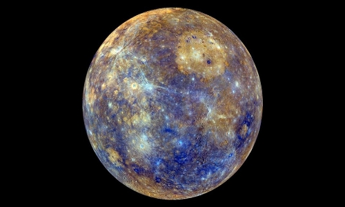
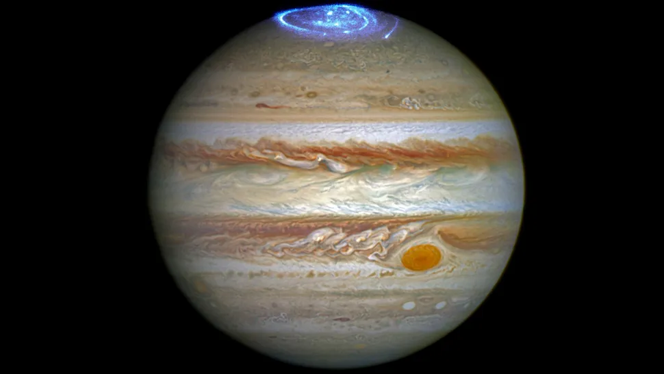

## **PLANETAS CERCANOS Y EL MAS GRANDE**

-----

## **MERCURIO**

Con un tamaño tan solo un poco mayor al de nuestra luna, Mercurio es el más pequeño de los planetas del sistema solar y el más cercano al Sol. A pesar de su pequeño tamaño este planeta ya era conocido al menos desde la época de los Sumerios, hace 5.000 años. Posteriormente los griegos lo bautizaron como Hermes, en honor al mensajero de los dioses del olimpo, el cual más tarde fue conocido por los romanos como Mercurio, nombre con el que ha llegado hasta nuestros días.

El nombre de este planeta no es casualidad pues, al igual que Mercurio era el más veloz de los dioses del Olimpo, con una velocidad de 170.5030 kilómetros por hora, el planeta Mercurio es el que viaja más rápido a través del espacio en nuestro sistema solar. Además, la órbita de Mercurio es la más excéntrica entre todos los planetas que orbitan el Sol, al que tarda 88 días en dar una vuelta completa.

Por su proximidad a nuestra estrella, desde la superficie de Mercurio nuestro Sol se vería 3 veces más grande que desde la Tierra, y su brillo sería hasta 7 veces superior. Del mismo modo, cabría esperar que, por su cercanía al Sol, Mercurio fuera el planeta más caliente del sistema solar, sin embargo, contradiciendo la intuición, este honor es para el Venus, pues es en Venus que, debido a su densa atmósfera, se registran las temperaturas más altas de todo el sistema solar. También cabe decir que eje de rotación de Mercurio está inclinado apenas 2 grados con respecto al plano de su órbita alrededor del Sol. Eso significa que gira casi perfectamente en posición vertical y, por lo tanto, no experimenta estaciones.

-----

## **MARTE**

Marte, el planeta Rojo. Rojo como la sangre, rojo como el oxido de hierro que tiñe su superficie. Así, no resulta extraño que el planeta Marte reciba su nombre en honor a Ares, el dios griego de la guerra. Más tarde los romanos lo bautizaron, tal y como ocurre con el resto de los planetas, con el equivalente en su mitología para los dioses griegos, en este caso Marte.

Marte, también conocido como el planeta Rojo, es el más alejado del Sol de los cuatro planetas rocosos del sistema solar, y el segundo más cercano a la Tierra, aunque cuenta aproximadamente con solo la mitad de su tamaño. Se trata de un planeta sencillo de identificar en el firmamento nocturno debido al brillo rojizo que hace honor a su nombre.

Pese a lo que pudiera parecer por su rojo color, Marte no es planeta cálido. Muy al contrario, en la actualidad se trata de un planeta seco, rocoso, inhóspito y frío, algo que no exime al planeta de haber albergado unas condiciones pasadas en las que la vida hubiera sido posible. Así, se cree que en el pasado Marte fue un mundo más cálido cubierto de agua, motivo por el que los científicos no cesan en su empeño de encontrar signos de vida pretérita. De hecho, en Marte podemos encontrar agua a día de hoy, no obstante la atmósfera marciana es demasiado delgada para que exista agua líquida por mucho tiempo en la superficie, por lo que la mayor parte del agua marciana se encuentra en forma de hielo debajo de la superficie, en las regiones polares.

-----

## **VENUS**

Solo tras el Sol y la Luna, Venus es el objeto más brillante que se puede ver en el firmamento desde la Tierra. Esto propició, ya desde la antigüedad, que por su brillo y belleza los romanos asociaran el planeta con la diosa de la belleza y el amor, Venus, de la cual recibe su nombre.

Parte de la intensidad del brillo de Venus es debido a la cercanía con la Tierra, ya que se trata del planeta que más próximo se encuentra de nosotros. Venus, además, es observable en el firmamento durante las 3 últimas horas después del atardecer y las 3 primeras antes del amanecer, lo que unido a la intensidad de su brillo, ha hecho que también sea denominado como el "Lucero del Alba".

También Venus el segundo planeta más cercano al Sol y el tercero en tamaño después de Mercurio y Marte. Al igual que Mercurio carece de satélites. Se trata de uno de los 4 planetas rocosos del sistema solar y debido a la gran similitud tanto en tamaño como en densidad con nuestro planeta, en ocasiones es denominado como el planeta gemelo de la Tierra. Sin embargo Venus no es tan parecido a la Tierra como cabría esperar. Por ejemplo, una gran diferencia con la Tierra y el resto de planetas del sistema solar es que Venus gira sobre su eje al contrario que los demás, es decir, en el caso de Venus el Sol sale por el oeste y se pone por el este. Además su rotación es tremendamente lenta, ya que tarda 243 días en dar una vuelta sobre si mismo, lo que propicia que el año en Venus, el cual dura 225 días, sea mas corto que un día en el propio planeta.

-----

## **JUPITER**

júpiter es el planeta más grande del sistema solar y el quinto planeta desde el sol. El gigante gaseoso tiene una larga y rica historia de científicos sorprendentes.

Llamado así por el tipo de dioses de la mitología romana, este "rey de los planetas" es un enigma tormentoso envuelto en nubes de colores. Su tormenta más prominente y famosa, la Gran Mancha Roja , tiene el doble del ancho de la Tierra.

Júpiter ayudó a revolucionar la forma en que veíamos el universo, y nuestro lugar en él, en 1610 cuando Galileo descubrió las cuatro grandes lunas de Júpiter: Io, Europa, Ganímedes y Calisto. Estas observaciones fueron la primera vez que se vieron cuerpos celestes dando vueltas alrededor de un objeto que no fuera la Tierra y apoyaron la visión copernicana de que la Tierra no era el centro del universo. Desde 2016, la nave espacial Juno de la NASA ha estado investigando a Júpiter y sus lunas.

